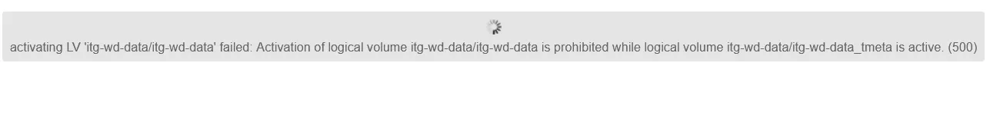

# 🛠️ LVM Thin Pool Repair – Step by Step Guide
### Date: 11-Jun-2026
### Author: Htoo Eain Lin

This guide explains how to **safely clean, repair, and re-activate an LVM thin pool**.



---

## 📌 Environment

* Volume Group: `itg-wd-data`
* Thin Pool: `itg-wd-data`
* Components:

  * `_tdata`
  * `_tmeta`

> ⚠️ Make sure **no VM, container, or mount** is using this pool before starting.

---

## Step 1️⃣ Deactivate all thin pool components

```bash
lvchange -an itg-wd-data/itg-wd-data_tdata
lvchange -an itg-wd-data/itg-wd-data_tmeta
lvchange -an itg-wd-data/itg-wd-data
```

**Explanation**:

* Safely turns off the thin pool and its metadata
* Prevents data corruption during repair

---

## Step 2️⃣ Check if metadata is in use

```bash
fuser -v /dev/mapper/itg--wd--data-itg--wd--data_tmeta
```

### If no output

* ✅ Safe to continue

### If a PID is shown

```bash
kill -9 <PID>
```

> ⚠️ Only kill the process if you are sure it is not critical.

---

## Step 3️⃣ Repair the thin pool metadata

```bash
lvconvert --repair itg-wd-data/itg-wd-data
```

**What this does**:

* Repairs thin pool metadata
* Re-links `_tdata` and `_tmeta`

---

## Step 4️⃣ Reactivate the thin pool

```bash
lvchange -ay itg-wd-data/itg-wd-data
```

LVM will automatically activate:

* `_tdata`
* `_tmeta`

---

## Step 5️⃣ Verify status

```bash
lvs -a -o +devices
```

You should see:

* `itg-wd-data`
* `itg-wd-data_tdata`
* `itg-wd-data_tmeta`
* Status: **active**

---

## 🔍 Optional: Kernel log check

```bash
dmesg | tail -20
```

Look for:

* Thin pool errors
* Metadata errors

---

## ✅ Result

* Thin pool repaired
* Metadata clean
* Storage ready for use

---

## 📝 Notes

* Recommended for **Proxmox LVM-Thin** environments
* Always keep backups of critical VM disks


